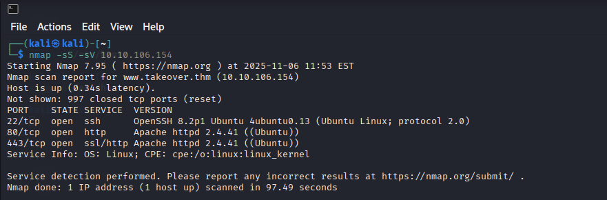

# TryHackMe-TakeOver-Walkthrough
This guide walks you through the process of identifying vulnerabilities, exploiting them, and ultimately capturing the flag.

# TakeOver

Created by: Abhay Ingale
Created time: November 6, 2025 10:26 PM

# CTF Solution Steps:

## 1. Nmap Scan:

So first we start our enumeration with the nmap scan using:

```bash
nmap -sS -sV <-Target IP->
```



Yeah. So we got port 22, 80 and 443 which are open and services are running.

## 2. Web Access:

As said in description we add the 10.10.106.154 in /etc/hosts for futurevera.thm. Also it says that they are rebuilding their support. So we add them in /etc/hosts file:


When we visit, it displays a landing page of :

> futurevera.thm
> 


But when we visit:

> support.futurevera.thm
> 

We get a warning!!


Click on view certificate, we get on this page:


Scrolling down a bit we see an alternative subdomain:


We add that subdomain in our /etc/hosts file:

> < - subdomain ->.support.futurevera.thm
> 


And now, let's see what we can find on it using a web browser (you need to access this subdomain on port 80, not port 443) :


> Also note that, if you are accessing the port 80, change it from https to http. Due to which you can avoid this error:
Error code: SSL_ERROR_RX_RECORD_TOO_LONG
> 

We are redirected to a AWS web server, but not found. And we can see the flag in the URL ! So we found the subdomain the black hats can take over (`flag{*******************************}.s3-website-us-west-3.amazonaws.com`) and the flag !

## Conclusion:

This room was very interesting, it made me search and try to understand what is `Subdomain takeover`, so I learned something new with this room.

If you want to learn more about `Subdomain takeover`, here is some useful links :

- [https://book.hacktricks.xyz/pentesting-web/domain-subdomain-takeover](https://book.hacktricks.xyz/pentesting-web/domain-subdomain-takeover)

Thanks for reading this write and I hope this helped you!!
